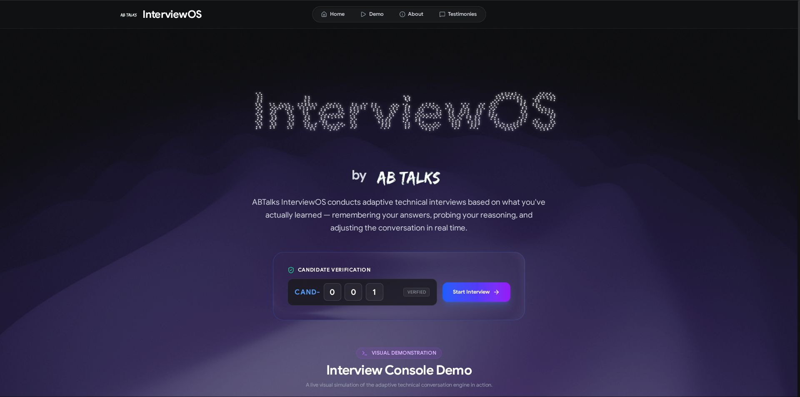
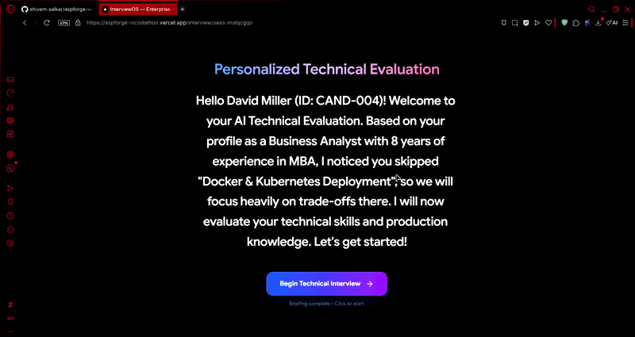
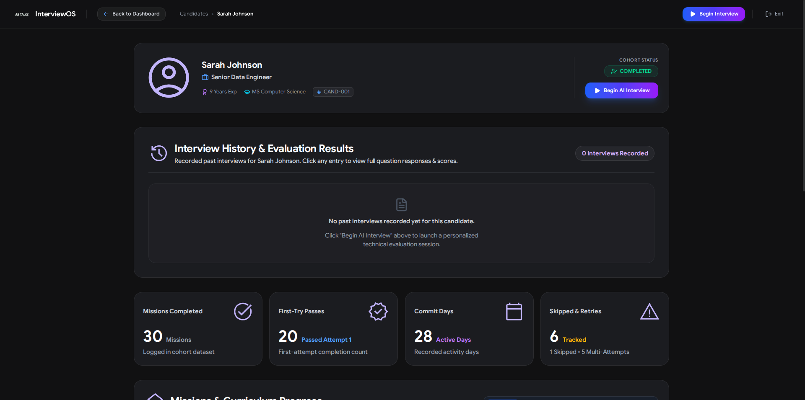
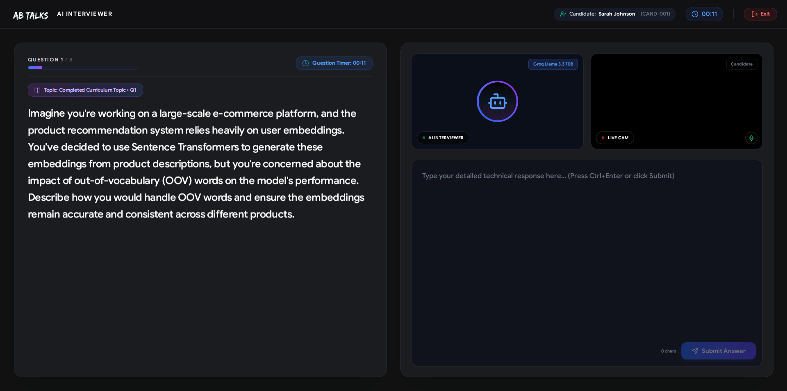

<a id="readme-top"></a>

<!-- PROJECT HEADER -->
<br />
<div align="center">
  <a href="https://github.com/shivam-salkar/aspforge-vicodathon">
    
  </a>

  <h3 align="center">InterviewOS</h3>
  <p align="center"><strong>Built for ABTalks Hackathon</strong></p>

  <p align="center">
    An Autonomous AI Technical Interviewer & Candidate Evaluation System
    <br />
    <br />
    <a href="#usage--screenshots">View Screenshots</a>
    &middot;
    <a href="#getting-started">Getting Started</a>
  </p>
</div>

<!-- TABLE OF CONTENTS -->
<details>
  <summary>Table of Contents</summary>
  <ol>
    <li>
      <a href="#about-the-project">About The Project</a>
      <ul>
        <li><a href="#the-situation">The Situation</a></li>
        <li><a href="#the-challenge">The Challenge</a></li>
        <li><a href="#minimum-requirements">Minimum Requirements</a></li>
        <li><a href="#what-was-provided">What Was Provided</a></li>
        <li><a href="#key-features">Key Features</a></li>
        <li><a href="#built-with">Built With</a></li>
      </ul>
    </li>
    <li>
      <a href="#getting-started">Getting Started</a>
      <ul>
        <li><a href="#prerequisites">Prerequisites</a></li>
        <li><a href="#installation">Installation</a></li>
      </ul>
    </li>
    <li><a href="#usage--screenshots">Usage & Screenshots</a></li>
  </ol>
</details>

<!-- ABOUT THE PROJECT -->
## About The Project


<br />


**InterviewOS** is an autonomous AI-powered technical interviewer built specifically for the **ABTalks Hackathon**. 

It conducts realistic, multi-turn technical interviews tailored to a candidate's progress through a 31-day AI Cohort curriculum, evaluating their understanding of concepts they built during the program and generating structured performance reports.

---

### The Situation

The **AI Cohort** is an intensive 31-day enterprise AI engineering program covering core modern AI topics, including:
* **Retrieval-Augmented Generation (RAG)**
* **Vector Databases**
* **Prompt Engineering**
* **Agentic AI & Orchestration**
* **Model Context Protocol (MCP)**
* **AI Deployment (Docker & Kubernetes)**
* **Production AI Systems & Observability**

After completing the cohort, learners must be able to confidently explain the systems they built and the engineering decisions behind them. However, preparing for technical interviews and effectively communicating this knowledge remains one of the biggest challenges.

---

### The Challenge

Design and build an **AI Interview Agent** capable of conducting a realistic, multi-turn technical interview that:
1. **Assesses Understanding**: Evaluates concepts the candidate completed during the 31-day cohort.
2. **Adapts Naturally**: Dynamically shifts topics and difficulty based on live candidate answers.
3. **Asks Intelligent Follow-ups**: Probes candidate depth when questions are answered correctly.
4. **Maintains Context**: Keeps conversation state across the entire interview session.
5. **Provides Actionable Feedback**: Generates structured, transparent feedback and scores at the conclusion of the interview.

---

### Minimum Requirements

Our hackathon solution satisfies all core requirements:
* ✅ **Conversational Technical Interview**: Multi-turn natural dialogue simulating a 1-on-1 engineering interview.
* ✅ **Curriculum Coverage**: Asks at least 8 main technical questions covering at least 4 different curriculum days.
* ✅ **Intelligent Follow-ups**: Evaluates answers in real time and asks targeted follow-up probes.
* ✅ **Context Persistence**: Maintains full conversation history and state throughout the session.
* ✅ **Structured Feedback**: Computes topic-level scoring breakdowns, time analysis, and right/wrong classifications.
* ✅ **Required HTTP Endpoint**: Exposes standard API routes as defined in the technical specification.

---

### What Was Provided

1. **Curriculum Data**: Structured JSON specifying 31 daily AI topics, learning objectives, and toolstacks.
2. **Candidate Profiles**: Synthetic dataset detailing cohort completion, attempts, skipped days, and learning signals for candidates (e.g. `CAND-001` to `CAND-013`).
3. **Technical Specification**: API contract and expected request/response formats.

---

### Key Features

* 🧠 **Adaptive AI Interview Engine**: Custom evaluation algorithm adjusting technical difficulty based on real-time candidate answers.
* 📊 **Comprehensive Evaluation Reports**: Automatic scoring across topics, right/wrong answer classification, and topic time analysis.
* 💾 **Episodic Memory Integration**: Breeth AI memory persistence tracking candidate progress and historical performance.
* ⚡ **Ultra-Fast LLM Inference**: Powered by Groq API (`llama-3.1-8b-instant` & `llama-3.3-70b-versatile`).

<p align="right">(<a href="#readme-top">back to top</a>)</p>

### Built With

* [![Next][Next.js]][Next-url]
* [![React][React.js]][React-url]
* [![TypeScript][TypeScript]][TypeScript-url]
* [![Express][Express.js]][Express-url]
* [![TailwindCSS][Tailwind]][Tailwind-url]
* [![Groq][Groq]][Groq-url]

<p align="right">(<a href="#readme-top">back to top</a>)</p>

<!-- GETTING STARTED -->
## Getting Started

Follow these simple steps to get InterviewOS running locally.

### Prerequisites

* **Node.js**: v18.0.0 or higher
* **npm**:
  ```sh
  npm install npm@latest -g
  ```
* **API Keys**:
  * Groq API Key ([Get one here](https://console.groq.com/))
  * Breeth AI API Key (`https://api.thebreeth.com/v1`)

### Installation

1. **Clone the repository**:
   ```sh
   git clone https://github.com/shivam-salkar/aspforge-vicodathon.git
   cd aspforge-vicodathon
   ```

2. **Install root & backend dependencies**:
   ```sh
   npm install
   ```

3. **Install frontend dependencies**:
   ```sh
   cd frontend && npm install && cd ..
   ```

4. **Configure Environment Variables**:
   Create a `.env` file in the project root:
   ```env
   GROQ_API_KEY=your_groq_api_key_here
   BREETH_API_KEY=your_breeth_api_key_here
   BREETH_BASE_URL=https://api.thebreeth.com/v1
   ```

5. **Run the Application**:
   * **Backend Server** (Express API on port 3001):
     ```sh
     npm run server
     ```
   * **Frontend Dashboard** (Next.js on port 3000):
     ```sh
     npm run dev:frontend
     ```

<p align="right">(<a href="#readme-top">back to top</a>)</p>

<!-- USAGE & SCREENSHOTS -->
## Usage & Screenshots

### 1. Landing Dashboard & Candidate Selection
Select a candidate from the cohort database by Candidate ID (e.g. `CAND-001` through `CAND-013`) to verify their learning record.


### 2. Candidate Profile & Telemetry
Inspect completed curriculum days, mission attempt history, commit signals, and topic mastery before beginning the technical interview.



### 3. Live Technical Interview Console
Engage in a live multi-turn technical interview with dynamic question generation, real-time question timers, and follow-up probes.



<p align="right">(<a href="#readme-top">back to top</a>)</p>

<!-- MARKDOWN LINKS -->
[Next.js]: https://img.shields.io/badge/next.js-000000?style=for-the-badge&logo=nextdotjs&logoColor=white
[Next-url]: https://nextjs.org/
[React.js]: https://img.shields.io/badge/React-20232A?style=for-the-badge&logo=react&logoColor=61DAFB
[React-url]: https://reactjs.org/
[TypeScript]: https://img.shields.io/badge/TypeScript-3178C6?style=for-the-badge&logo=typescript&logoColor=white
[TypeScript-url]: https://www.typescriptlang.org/
[Express.js]: https://img.shields.io/badge/Express.js-000000?style=for-the-badge&logo=express&logoColor=white
[Express-url]: https://expressjs.com/
[Tailwind]: https://img.shields.io/badge/TailwindCSS-06B6D4?style=for-the-badge&logo=tailwindcss&logoColor=white
[Tailwind-url]: https://tailwindcss.com/
[Groq]: https://img.shields.io/badge/Groq-F54900?style=for-the-badge&logo=groq&logoColor=white
[Groq-url]: https://groq.com/
